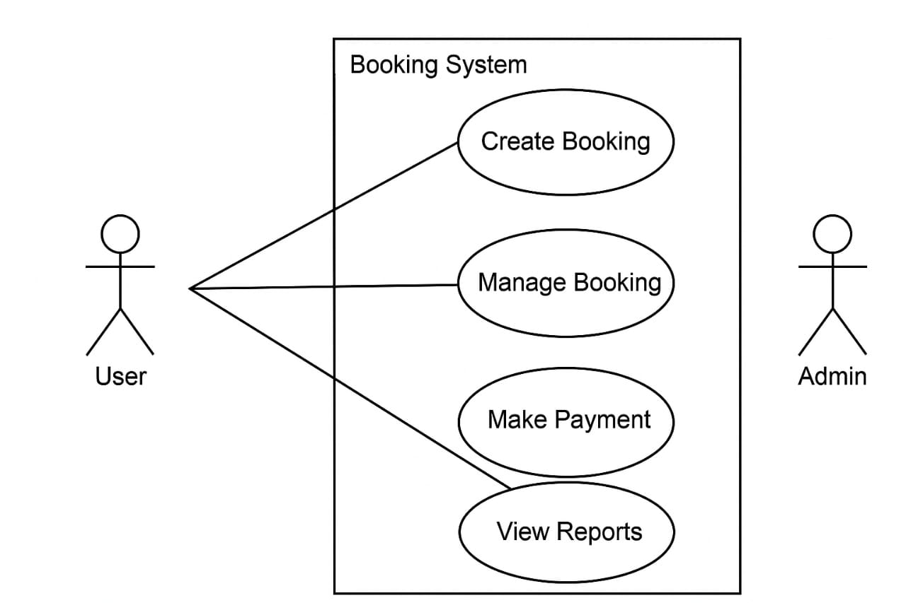

# Requirement Analysis in Software Development

Welcome to the *Requirement Analysis in Software Development* repository.

This repository is dedicated to exploring the crucial phase of requirement analysis in the software development lifecycle. It provides insights, documentation templates, and examples to help understand and execute effective requirement gathering and analysis practices. Whether you're a student, developer, or project manager, this repository offers resources to guide you in transforming user needs into clear, actionable software requirements.

## What is Requirement Analysis?

**Requirement Analysis** is the process of identifying, gathering, analyzing, and documenting the needs and expectations of stakeholders for a software system. It serves as the foundation of any successful software project, ensuring that the end product aligns with user needs and business goals.

### Importance in the Software Development Lifecycle (SDLC)

Requirement Analysis is a critical phase in the SDLC because it:

- **Defines project scope**: Helps stakeholders and developers understand what the system should do, avoiding misunderstandings and scope creep.
- **Improves communication**: Establishes a common language between business users, analysts, designers, and developers.
- **Reduces risks**: Identifies potential issues early in the project, saving time and resources.
- **Ensures quality**: Well-defined requirements lead to systems that meet user expectations and pass validation and testing phases more effectively.
- **Guides design and development**: Acts as a blueprint for developers and a reference point for testing and validation teams.

Overall, Requirement Analysis helps bridge the gap between the problem space (what users need) and the solution space (what developers will build), setting the stage for delivering a successful software product.

## Why is Requirement Analysis Important?

Requirement Analysis is essential to the success of software projects for several key reasons:

1. **Prevents Miscommunication and Misunderstanding**
   - By clearly documenting user needs and expectations, requirement analysis minimizes the chances of confusion between stakeholders and development teams. Everyone involved understands what the system is supposed to do from the beginning.

2. **Improves Project Planning and Cost Estimation**
   - With clear requirements, project managers can estimate time, resources, and budget more accurately. This leads to better scheduling and helps prevent costly changes later in the development process.

3. **Ensures Product Quality and User Satisfaction**

## Key Activities in Requirement Analysis

The process of Requirement Analysis involves several key activities that ensure a clear understanding of what needs to be built. These activities help transform vague ideas into well-defined software requirements.

- **Requirement Gathering**  
  This involves collecting requirements from stakeholders such as users, customers, business managers, and subject matter experts. It lays the foundation for understanding what the system must accomplish.

- **Requirement Elicitation**  
  Elicitation is about drawing out information through techniques such as interviews, questionnaires, observations, and workshops. It focuses on uncovering implicit, hidden, or assumed needs that may not be immediately obvious.

- **Requirement Documentation**  
  All gathered and elicited requirements are documented in a clear and structured format. Common documentation tools include Software Requirements Specifications (SRS), user stories, and use cases.

- **Requirement Analysis and Modeling**  
  In this step, requirements are analyzed for feasibility, consistency, and completeness. Visual models like data flow diagrams (DFDs), UML diagrams, and wireframes may be used to represent the requirements more clearly.

- **Requirement Validation**  
  Validation ensures that the documented requirements accurately reflect stakeholder needs and that they are achievable within project constraints. Techniques include reviews, walkthroughs, and prototyping.

## Types of Requirements

In software development, requirements are typically classified into two main categories: **Functional Requirements** and **Non-functional Requirements**. Both are essential to ensure the system works correctly and meets user expectations.

### Functional Requirements

Functional requirements describe *what* the system should do. These define the features, functions, and behaviors of the system that support user needs and business processes.

**Examples for a Booking Management Project:**
- The system shall allow users to create, view, update, and cancel bookings.
- Users shall receive email confirmations after successfully booking.
- The admin panel shall allow staff to view all upcoming bookings in a calendar format.
- The system shall prevent double-booking of the same time slot.
- Customers shall be able to search for available rooms or services based on date and type.

### Non-functional Requirements

Non-functional requirements describe *how* the system performs its functions. These cover quality attributes such as performance, usability, security, and reliability.

**Examples for a Booking Management Project:**
- The system shall respond to user actions within 2 seconds.
- The application shall be available 99.9% of the time (uptime requirement).
- User data shall be encrypted using industry-standard encryption (e.g., AES-256).
- The system shall support at least 500 concurrent users without performance degradation.
- The UI shall be mobile-responsive and accessible according to WCAG 2.1 standards.

## Use Case Diagrams

Use Case Diagrams are a visual representation of a system’s functional requirements from a user’s perspective. They depict the interactions between external actors (users or other systems) and the system itself through various use cases (tasks or services).

### Benefits of Use Case Diagrams:
- Simplify complex requirements into an easy-to-understand visual.
- Help identify system boundaries and user roles.
- Facilitate communication between stakeholders and development teams.
- Serve as a foundation for writing detailed use case scenarios.

  

### Booking System Use Case Diagram

The following diagram illustrates a simplified use case model for a Booking Management System. It includes primary actors like customers and admins, as well as the core use cases they interact with.

## Acceptance Criteria

Acceptance Criteria are specific, measurable conditions that a software product must satisfy to be accepted by stakeholders. They define what "done" means for a feature or user story and ensure the software meets the expected functionality and quality.

### Importance of Acceptance Criteria:
- **Clarity:** Provides clear expectations for developers, testers, and stakeholders.
- **Validation:** Ensures that features meet user needs and business requirements.
- **Testing:** Forms the basis for writing test cases and performing validation.
- **Communication:** Reduces ambiguity by aligning everyone on what success looks like.

### Example: Acceptance Criteria for the "Checkout" Feature in the Booking Management System

**Feature:** Checkout

**Acceptance Criteria:**
- The user must be able to review the booking summary before final confirmation.
- The system must display the total amount including any applicable taxes or fees.
- The user must be able to select a payment method (e.g., credit card, PayPal).
- Upon successful payment, the system must generate a confirmation number.
- A confirmation email must be sent to the user within 2 minutes of checkout.
- If payment fails, the user must receive an error message and have the option to retry.

